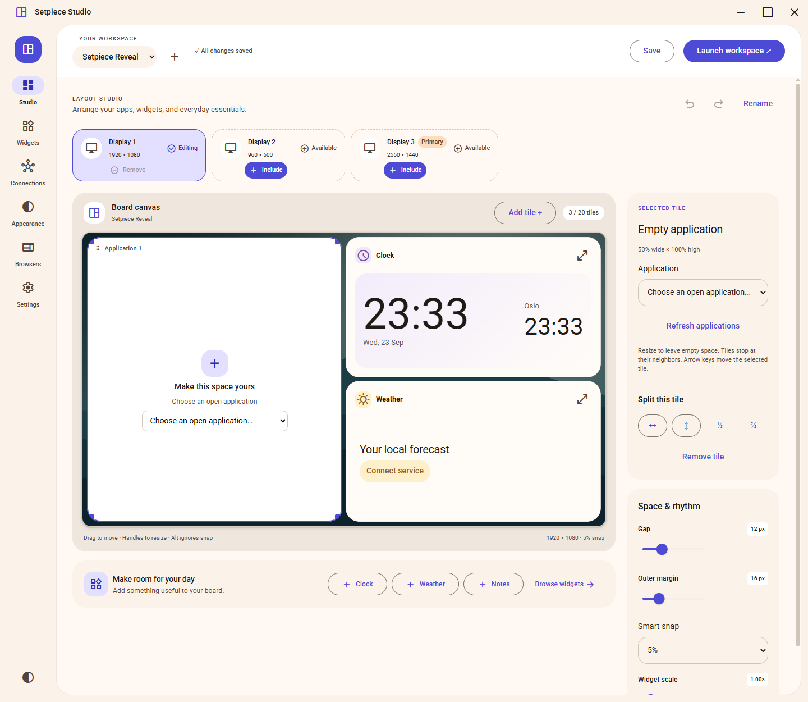

# Setpiece

Setpiece is a Windows workspace manager. Arrange applications, widgets, and persistent browser sessions into saved layouts, with a separate layout for each display.

**[Explore Setpiece](https://rmarkegard.github.io/Setpiece/)** · [Build from source](#build-from-source) · [Report an issue](https://github.com/rmarkegard/Setpiece/issues) · [Contribute](CONTRIBUTING.md)

[](https://rmarkegard.github.io/Setpiece/)

## Features

- **Arrange your apps.** Assign open Windows applications to movable, resizable tiles.
- **Widgets.** Add clocks, notes, and other widgets to a layout.
- **Persistent browsers.** Named WebView2 browsers retain tabs across profiles, with optional fullscreen contained inside a tile.
- **Appearance.** Choose light or dark, an accent color, and a wallpaper for each profile.
- **Window restoration.** Stop the workspace to restore original windows and taskbars.

Built with Angular Material, a .NET Windows host, and native window placement. The public repository currently provides source; the packaged archive is built locally using the instructions below.

## License

This project’s source is available under the [PolyForm Noncommercial License 1.0.0](LICENSE). You may use, modify, fork, and share it for permitted noncommercial purposes. Commercial use is not permitted by that license. This is source-available software, not an OSI-approved open source license. Bundled third-party components retain their own licenses; see [third-party notices](THIRD-PARTY-NOTICES.md).

## Supported system

- Windows 11 x64 (verified on Windows 11 build 26100)
- .NET 10 Desktop Runtime x64
- Microsoft Edge WebView2 Evergreen Runtime

The distributed app is framework-dependent, so install the .NET Desktop Runtime before launching. The WebView2 Runtime is a separate requirement. The source build additionally needs the .NET 10 SDK, Node.js 24.15 or newer, and pnpm 11.

## Build from source

In PowerShell, from the repository root:

```powershell
Set-Location UI
pnpm install --frozen-lockfile
Set-Location ..
.\build.ps1
```

The build script creates the production UI and Release executable, runs the UI layout/domain/theme tests and native verification checks, and writes a transcript to `artifacts/production-build.log`. `-Relaunch` opens the resulting executable. `-DataRoot` selects an isolated profile for that relaunch.

## Run

The source build is at `Setpiece/bin/Release/net10.0-windows/Setpiece.exe`. Keep the entire `net10.0-windows` directory together. For the local zip package, extract the archive and run `Setpiece.exe`; install the runtimes above first. The release package script is:

```powershell
.\tools\package-release.ps1
```

It builds and verifies a local archive at `release/Setpiece-2.0.0-windows-x64.zip`. Use `-SkipBuild` only when the current Release output has already been built and verified. The script does not publish or upload the archive.

## First use

1. Create a profile in Studio and select a display.
2. Choose a preset, preview it, and apply it. The preview follows that display’s resolution and aspect ratio. Drag tile headers to move; use the selected tile’s edge and corner handles to resize. Tiles stop at neighbors, and removed tiles leave empty space. Add a tile to fill available space, or split an existing tile. Hold Alt to ignore snapping.
3. Assign an open application through Apps, add a widget through Widgets, or link a named browser through Browsers.
4. Save the profile and launch the workspace. Dragging an assigned application’s own frame detaches it without changing the layout.
5. Use Settings → Stop workspace & restore applications to restore original windows and taskbars. Closing Setpiece also restores them.

Ctrl+S saves. Ctrl+Z and Ctrl+Shift+Z undo and redo layout edits while Setpiece has focus. Closing or switching profiles prompts when there are unsaved changes. Notes save as you type.

Appearance preferences apply immediately across open surfaces. Wallpapers belong to profiles. Setpiece supports light and dark themes and a global accent picker. Surface details (opacity, dimming, glow, corners, and reduced motion) are expandable. Previous color themes migrate to corresponding accent colors; an existing custom accent takes priority. Very narrow tiles reduce the effective gap to keep their content area positive.

Named browsers retain their running tabs when switching profiles. Use the diamond control to collapse or expand the toolbar. Diagnostics shows the WebView2 runtime and bundled uBlock Origin Lite status. External webpages have no Setpiece host bridge.

## Data and integrations

Normal data lives under `%APPDATA%/Setpiece`; profiles are under `Profiles`. Existing profile fields and encrypted connection data are read compatibly. Saves preserve unknown fields, use atomic replacement, and retain unreadable files rather than resetting them. Connection secrets use Windows current-user DPAPI.

Weather, Ruter, and VG News can show public data without account sign-in. Other integrations require the accounts, app registration, desktop software, or hardware described in their connection guides. Missing hardware and authorization have explicit states. Markets, Focus, and GitHub are labeled previews; X/Twitter is retired.

For isolated testing, pass a separate directory with `--data-root "C:\path\to\test-data"`. Do not use a production data directory for capture or destructive fixture tests.

## Verify and prepare a reveal

```powershell
dotnet run --project Verification/Setpiece.Verification.csproj -c Release
dotnet test Setpiece.Tests/Setpiece.Tests.csproj -c Release
dotnet run --project Verification.Integration/Setpiece.Verification.Integration.csproj -c Release -- --live
```

The optional live checks use public weather/transit data and inspect local service states; they do not authorize external accounts. For current build evidence and unverified environments, read [verification](docs/VERIFICATION.md) and [release readiness](docs/RELEASE-READINESS.md). The isolated [reveal setup and shot list](docs/reveal/SHOT-LIST.md) includes a reset procedure. [Phase 0](docs/PHASE-0.md) records the original architecture and requirements.

## Project page

The project site is live at [rmarkegard.github.io/Setpiece](https://rmarkegard.github.io/Setpiece/). Its source is [`docs/index.html`](docs/index.html), served from the `main` branch’s `/docs` folder without an external build step. The page uses real application screenshots with product details and build instructions.
