# Setpiece

Setpiece is a Windows workspace manager. It tiles your apps, live widgets and persistent browsers into saved layouts, one for each display, and launches the whole desk in one click. The interface is Material 3 Expressive, in light or dark, and colored by a single accent of your choice.

**[Explore Setpiece](https://rmarkegard.github.io/Setpiece/)** · [Build from source](#build-from-source) · [Report an issue](https://github.com/rmarkegard/Setpiece/issues) · [Contribute](CONTRIBUTING.md)

<a href="https://rmarkegard.github.io/Setpiece/">
  <picture>
    <source media="(prefers-color-scheme: light)" srcset="docs/screenshots/light-studio.png">
    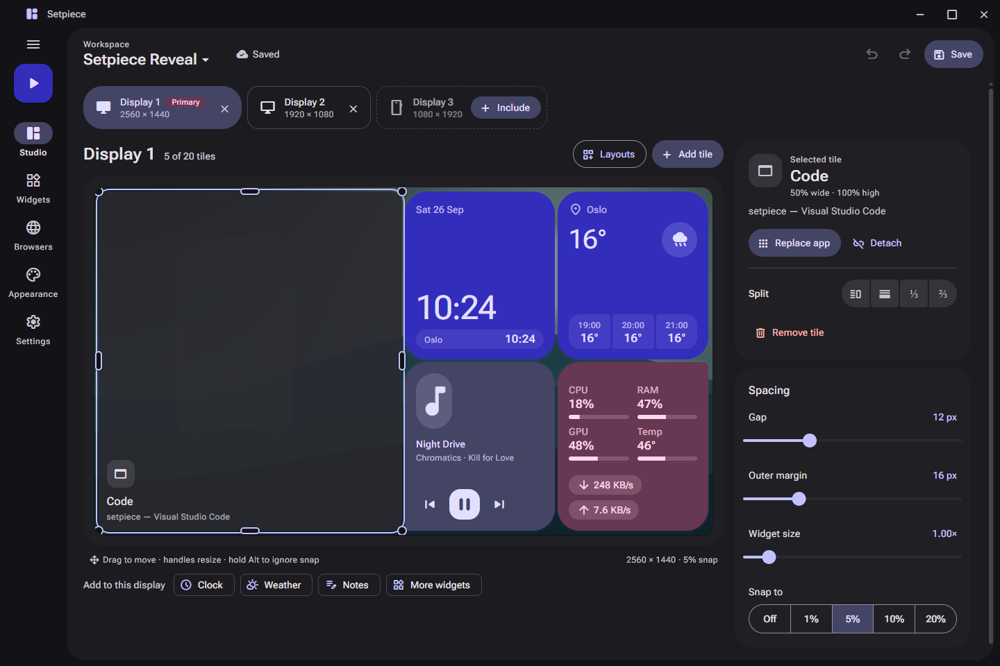
  </picture>
</a>

## A quick look

<table>
  <tr>
    <td width="50%"><picture><source media="(prefers-color-scheme: light)" srcset="docs/screenshots/light-widgets.png">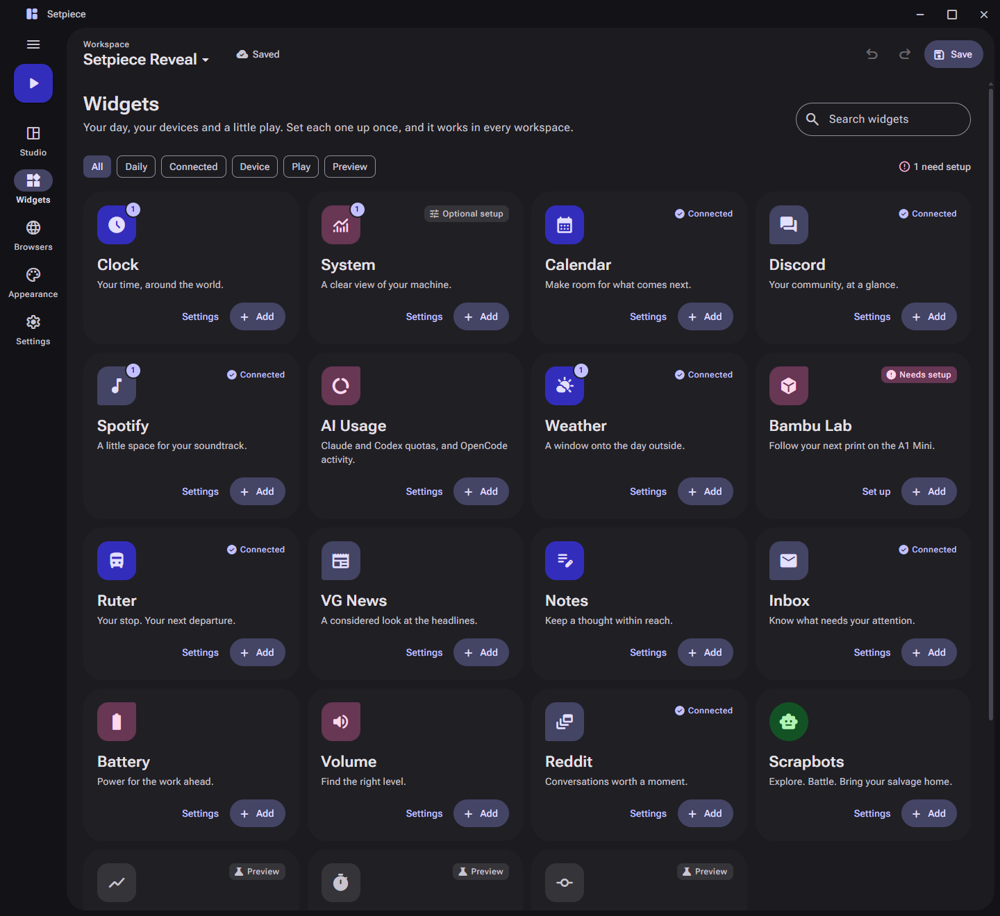</picture><br><b>Widgets.</b> Every widget and its connection in one library.</td>
    <td width="50%"><picture><source media="(prefers-color-scheme: light)" srcset="docs/screenshots/light-dialog.png">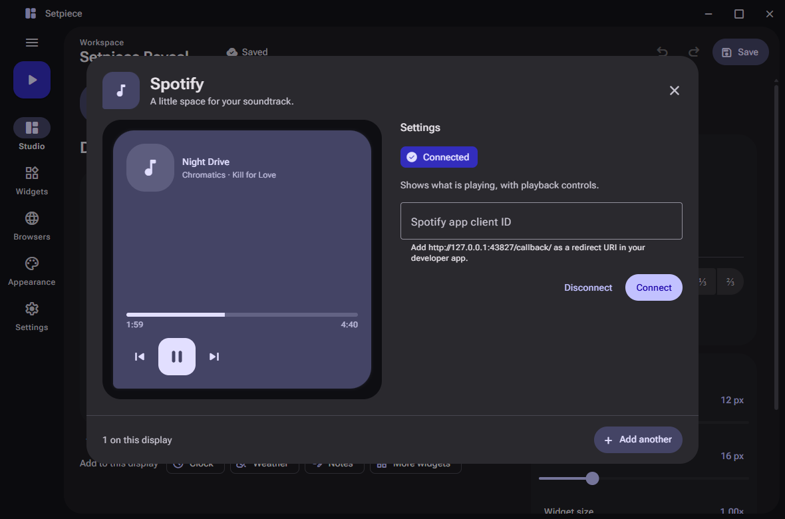</picture><br><b>Setup.</b> A live preview beside each widget's settings.</td>
  </tr>
  <tr>
    <td width="50%"><picture><source media="(prefers-color-scheme: light)" srcset="docs/screenshots/light-browsers.png">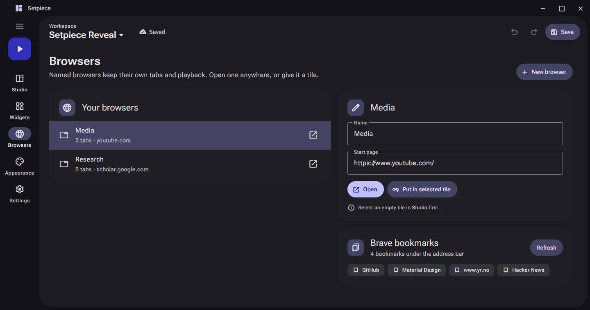</picture><br><b>Browsers.</b> Named sessions you can open anywhere or put in a tile.</td>
    <td width="50%"><picture><source media="(prefers-color-scheme: light)" srcset="docs/screenshots/light-appearance.png">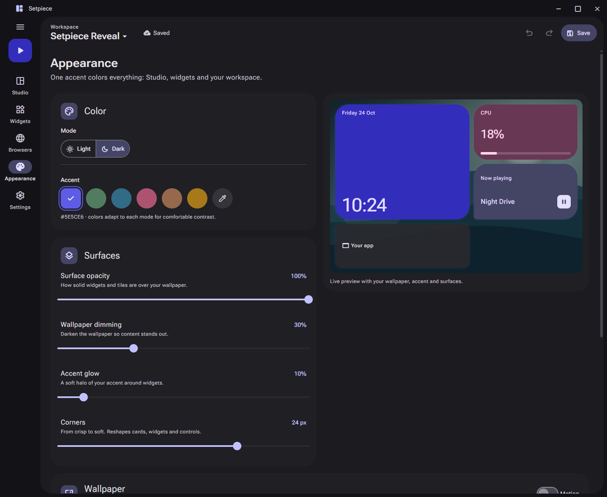</picture><br><b>Appearance.</b> One accent, light or dark, and a wallpaper per workspace.</td>
  </tr>
</table>

## Widgets

Sixteen widgets, each colored from your accent by category, with a shape of its own: **Daily** (Clock, Calendar, Weather, Ruter, Notes), **Connected** (Spotify, Discord, Inbox, VG News, Reddit), **Device** (System, Battery, Volume, AI Usage, Bambu Lab) and **Play** (Scrapbots). Each adapts to the size of its tile, and each is set up once for every workspace.

<p>
  <picture><source media="(prefers-color-scheme: light)" srcset="docs/screenshots/widgets/light-clock.png">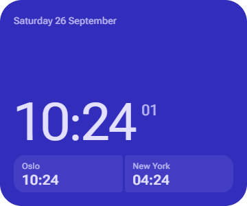</picture>
  <picture><source media="(prefers-color-scheme: light)" srcset="docs/screenshots/widgets/light-weather.png">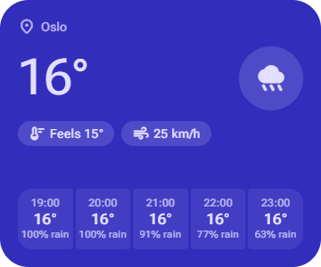</picture>
  <picture><source media="(prefers-color-scheme: light)" srcset="docs/screenshots/widgets/light-spotify.png">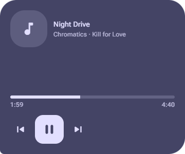</picture>
  <picture><source media="(prefers-color-scheme: light)" srcset="docs/screenshots/widgets/light-system.png">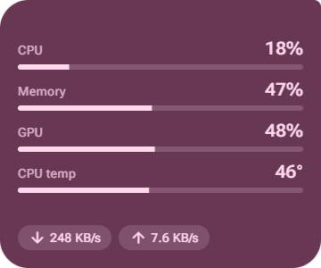</picture>
</p>

## Shared browsers, and fullscreen inside a tile

Put a named browser (Media, Research, Music) in any tile. Each keeps its own tabs, sign-ins and playback across every workspace, with a slim toolbar for tabs, the address and your Brave bookmarks. Web pages get no access to Setpiece, and uBlock Origin Lite is built in.

Turn on **Keep fullscreen inside the tile** for a browser tile, and fullscreen video, slides or games fill that tile instead of the whole monitor, so your widgets, chat and editor stay in view.

<table>
  <tr>
    <td width="33%"><picture><source media="(prefers-color-scheme: light)" srcset="docs/screenshots/fullscreen/fullscreen-light-tiled.png">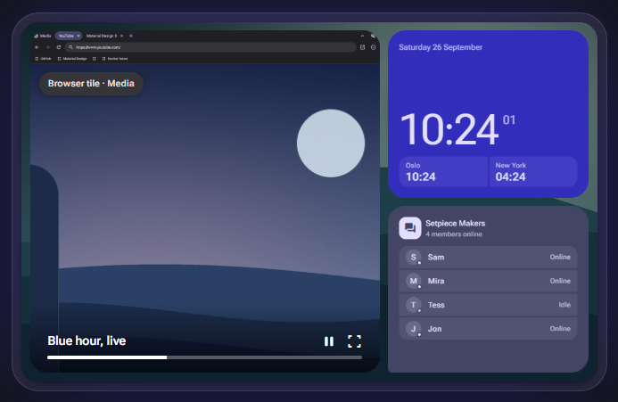</picture><br><b>Tiled.</b> A video in its browser tile.</td>
    <td width="33%"><picture><source media="(prefers-color-scheme: light)" srcset="docs/screenshots/fullscreen/fullscreen-light-in-tile.png">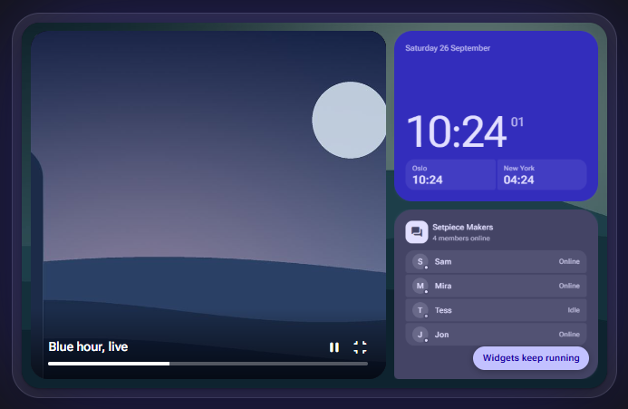</picture><br><b>Fullscreen in the tile.</b> The rest of the desk stays.</td>
    <td width="33%"><picture><source media="(prefers-color-scheme: light)" srcset="docs/screenshots/fullscreen/fullscreen-light-whole-monitor.png">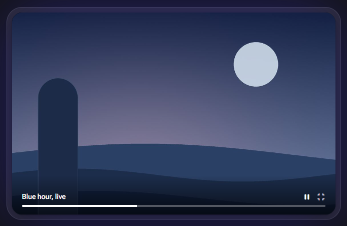</picture><br><b>Ordinary fullscreen.</b> Everything else is covered.</td>
  </tr>
</table>

Try it interactively on the [project page](https://rmarkegard.github.io/Setpiece/#browsers).

## Features

- **Arrange your apps.** Assign open Windows apps to tiles; drag, resize, split and snap them on a live board. Drop a tile on another to swap them.
- **Every display, its own layout.** Include the displays a workspace uses, portrait ones too, each at its real aspect ratio. Start from a layout preset, preview it, then apply.
- **Widgets.** Sixteen live widgets with one setup flow, a live preview, and clear setup status.
- **Shared browsers.** Named WebView2 sessions with persistent tabs and fullscreen contained inside a tile.
- **Appearance.** Material 3 Expressive. Light or dark, one accent that recolors everything, surface and corner controls, and eleven wallpapers.
- **Workspaces.** Save several, switch in one click, and never lose unsaved changes silently.
- **Window restoration.** Stop the workspace, or close Setpiece, to restore original windows and taskbars.

Built with Angular Material, a .NET Windows host, and native window placement. The public repository currently provides source; the packaged archive is built locally using the instructions below. Screenshots come from the development preview, which runs the real interface with sample data.

## License

This project’s source is available under the [PolyForm Noncommercial License 1.0.0](LICENSE). You may use, modify, fork, and share it for permitted noncommercial purposes. Commercial use is not permitted by that license. This is source-available software, not an OSI-approved open source license. Bundled third-party components retain their own licenses; see [third-party notices](THIRD-PARTY-NOTICES.md).

## Supported system

- Windows 11 x64 (verified on Windows 11 build 26100)
- .NET 10 Desktop Runtime x64
- Microsoft Edge WebView2 Evergreen Runtime

The distributed app is framework-dependent, so install the .NET Desktop Runtime before launching. The WebView2 Runtime is a separate requirement. The source build additionally needs the .NET 10 SDK, Node.js 24.15 or newer, and pnpm 11.

## Build from source

In PowerShell, from the repository root:

```powershell
Set-Location UI
pnpm install --frozen-lockfile
Set-Location ..
.\build.ps1
```

The build script creates the production UI and Release executable, runs the UI layout/domain/theme tests and native verification checks, and writes a transcript to `artifacts/production-build.log`. `-Relaunch` opens the resulting executable. `-DataRoot` selects an isolated profile for that relaunch.

## Run

The source build is at `Setpiece/bin/Release/net10.0-windows/Setpiece.exe`. Keep the entire `net10.0-windows` directory together. For the local zip package, extract the archive and run `Setpiece.exe`; install the runtimes above first. The release package script is:

```powershell
.\tools\package-release.ps1
```

It builds and verifies a local archive at `release/Setpiece-2.0.0-windows-x64.zip`. Use `-SkipBuild` only when the current Release output has already been built and verified. The script does not publish or upload the archive.

To build the per-user Windows installer, install Inno Setup 6 and run:

```powershell
.\tools\package-installer.ps1
```

The script packages the same app and notices as the zip into `release/Setpiece-2.0.0-windows-x64-setup.exe`. Set `ISCC_PATH` if `ISCC.exe` is outside the usual install path. The installer creates Start menu and optional desktop shortcuts, and uninstall removes only the installed program files. The separate .NET Desktop and WebView2 runtimes remain prerequisites.

Settings → Updates checks the latest published GitHub Release on demand. When a newer three-part version has a matching installer asset with a SHA-256 digest, Setpiece can download, verify, and launch it. A release maintainer must upload the installer under the generated filename; draft and prerelease releases are ignored. The installed app does not update silently.

## First use

1. Create a workspace from the workspace menu at the top of Studio, and pick a display.
2. Start from Layouts, preview it, and apply it. The board follows that display's resolution and aspect ratio. Drag tiles to move them (widgets move by the grip on their top edge), and use the selected tile's edge and corner handles to resize. Tiles stop at neighbors, and removed tiles leave empty space. Add a tile to fill available space, or split an existing tile. Hold Alt to ignore snapping.
3. Choose an open app for a tile, add a widget from Widgets, or put a named browser in a tile from Browsers.
4. Save the workspace and launch it. Dragging an assigned application's own frame detaches it without changing the layout.
5. Use Settings → Stop the workspace to restore original windows and taskbars. Closing Setpiece also restores them.

Ctrl+S saves. Ctrl+Z and Ctrl+Shift+Z undo and redo layout edits while Setpiece has focus. Closing or switching workspaces prompts when there are unsaved changes. Notes save as you type.

Appearance preferences apply immediately across open surfaces. Wallpapers belong to workspaces. Setpiece uses Material 3 with light and dark modes and a single accent color that drives every surface; widgets take their colors from their category (Daily, Connected, Device, Play). Surfaces (opacity, dimming, glow and corners) live on the Appearance page; interface size, text size and reduced motion live in Settings. Previous color themes migrate to corresponding accent colors; an existing custom accent takes priority. Very narrow tiles reduce the effective gap to keep their content area positive.

Named browsers retain their running tabs when switching workspaces. Use the arrow control to collapse or expand the toolbar. Browser information shows the WebView2 runtime and bundled uBlock Origin Lite status. External webpages have no Setpiece host bridge.

## Data and integrations

Normal data lives under `%APPDATA%/Setpiece`; profiles are under `Profiles`. Existing profile fields and encrypted connection data are read compatibly. Saves preserve unknown fields, use atomic replacement, and retain unreadable files rather than resetting them. Connection secrets use Windows current-user DPAPI.

Weather, Ruter, and VG News can show public data without account sign-in. Other integrations require the accounts, app registration, desktop software, or hardware described in their connection guides. Missing hardware and authorization have explicit states. Markets, Focus, and GitHub are labeled previews; X/Twitter is retired.

For isolated testing, pass a separate directory with `--data-root "C:\path\to\test-data"`. Do not use a production data directory for capture or destructive fixture tests.

## Verify and prepare a reveal

```powershell
dotnet run --project Verification/Setpiece.Verification.csproj -c Release
dotnet test Setpiece.Tests/Setpiece.Tests.csproj -c Release
dotnet run --project Verification.Integration/Setpiece.Verification.Integration.csproj -c Release -- --live
```

The optional live checks use public weather/transit data and inspect local service states; they do not authorize external accounts. For current build evidence and unverified environments, read [verification](docs/VERIFICATION.md) and [release readiness](docs/RELEASE-READINESS.md). The isolated [reveal setup and shot list](docs/reveal/SHOT-LIST.md) includes a reset procedure. [Phase 0](docs/PHASE-0.md) records the original architecture and requirements.

## Project page

The project site is live at [rmarkegard.github.io/Setpiece](https://rmarkegard.github.io/Setpiece/). Its source is [`docs/index.html`](docs/index.html) with `site.css` and `site.js`, served from the `main` branch's `/docs` folder without a build step. It follows the reader's light or dark preference (`?theme=light` or `?theme=dark` forces one) and includes an interactive fullscreen-in-a-tile demo.

Screenshots in [`docs/screenshots`](docs/screenshots) come from the development preview, which runs the real interface against sample data. Start it with `pnpm start` in `UI`, then open `http://127.0.0.1:4200/?mock=1`. Useful parameters: `route=Widgets` (with `capture=1`), `mode=light`, `accent=517c60`, `mockTime=10:24`, `mockState=disconnected`, `widget=clock&surface=1` for a single widget, and `browser=Media` for the browser toolbar. The mock is replaced by a no-op in production builds. For wallpapers in the preview, link them once from the repository root: `New-Item -ItemType Junction UI\dev-assets -Target Setpiece\Assets\Wallpapers` (the link is git-ignored).
