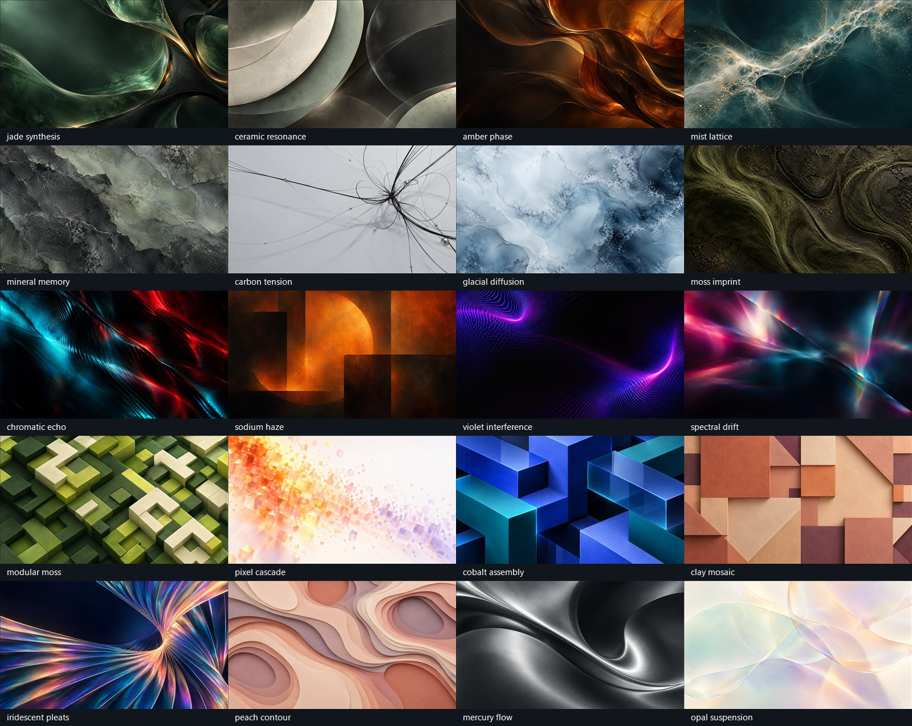

# Abstract wallpaper collection

Twenty fully abstract AI-generated wallpapers replace the ten procedural wallpapers and their video loops. Ambient remains available as the theme-based option.

## Art direction

The Creator, Death Stranding, Blade Runner, and Minecraft inform only the mood, color, texture, light, and geometry. Every image is nonrepresentational: no movie scenes, game worlds, landscapes, buildings, or characters.

The collection balances dark and light palettes, organic curves and modular forms, smooth translucency and weathered texture, sparse linework and layered detail.

## Collection

### Organic futurism

- [jade synthesis](../../Setpiece/Assets/Wallpapers/jade-synthesis.jpg)
- [ceramic resonance](../../Setpiece/Assets/Wallpapers/ceramic-resonance.jpg)
- [amber phase](../../Setpiece/Assets/Wallpapers/amber-phase.jpg)
- [mist lattice](../../Setpiece/Assets/Wallpapers/mist-lattice.jpg)

### Weathered matter

- [mineral memory](../../Setpiece/Assets/Wallpapers/mineral-memory.jpg)
- [carbon tension](../../Setpiece/Assets/Wallpapers/carbon-tension.jpg)
- [glacial diffusion](../../Setpiece/Assets/Wallpapers/glacial-diffusion.jpg)
- [moss imprint](../../Setpiece/Assets/Wallpapers/moss-imprint.jpg)

### Nocturnal light

- [chromatic echo](../../Setpiece/Assets/Wallpapers/chromatic-echo.jpg)
- [sodium haze](../../Setpiece/Assets/Wallpapers/sodium-haze.jpg)
- [violet interference](../../Setpiece/Assets/Wallpapers/violet-interference.jpg)
- [spectral drift](../../Setpiece/Assets/Wallpapers/spectral-drift.jpg)

### Modular color

- [modular moss](../../Setpiece/Assets/Wallpapers/modular-moss.jpg)
- [pixel cascade](../../Setpiece/Assets/Wallpapers/pixel-cascade.jpg)
- [cobalt assembly](../../Setpiece/Assets/Wallpapers/cobalt-assembly.jpg)
- [clay mosaic](../../Setpiece/Assets/Wallpapers/clay-mosaic.jpg)

### Material flow

- [iridescent pleats](../../Setpiece/Assets/Wallpapers/iridescent-pleats.jpg)
- [peach contour](../../Setpiece/Assets/Wallpapers/peach-contour.jpg)
- [mercury flow](../../Setpiece/Assets/Wallpapers/mercury-flow.jpg)
- [opal suspension](../../Setpiece/Assets/Wallpapers/opal-suspension.jpg)

## Artwork and delivery

Created on 2026-09-26 with the built-in OpenAI image generation tool, one generation per image, using the [recorded prompts](prompts.json). These are newly generated abstract compositions, with no imported movie frames, game screenshots, or third-party texture assets.

The tool returned 1672 × 941 pixels (Clay Mosaic: 1672 × 940). JPEGs preserve that native resolution and framing; they are not upscaled or advertised as 1440p/4K. JPEG quality 92 keeps the complete set around 5.7 MiB. The artwork is included under the repository's license.

The moving-wallpaper switch applies a subtle, synchronized 48-second CSS pan/zoom cycle to each still. Ambient retains its breathing gradient. Both the app's Reduced motion setting and the system's prefers-reduced-motion setting disable animation. Static mode uses the uncropped source apart from normal cover fitting. No video downloads or codecs are required.

## Existing profiles

The Windows host migrates legacy IDs during normalization; future saves store the new ID. Animation preferences and unrelated profile fields are retained. Unknown IDs still fall back to Ambient.

| Previous wallpaper | Replacement |
| --- | --- |
| fjord-glass | jade-synthesis |
| paper-horizon | peach-contour |
| moss-geometry | modular-moss |
| blue-hour | glacial-diffusion |
| ember-grid | chromatic-echo |
| slate-dunes | mineral-memory |
| orchard-mist | moss-imprint |
| violet-current | violet-interference |
| quiet-coast | ceramic-resonance |
| mono-bloom | mercury-flow |

The old procedural generator was removed so maintenance scripts cannot recreate the retired assets. To replace an image later, generate abstract artwork using its recorded prompt, inspect it, and save the approved JPEG with the same filename.
